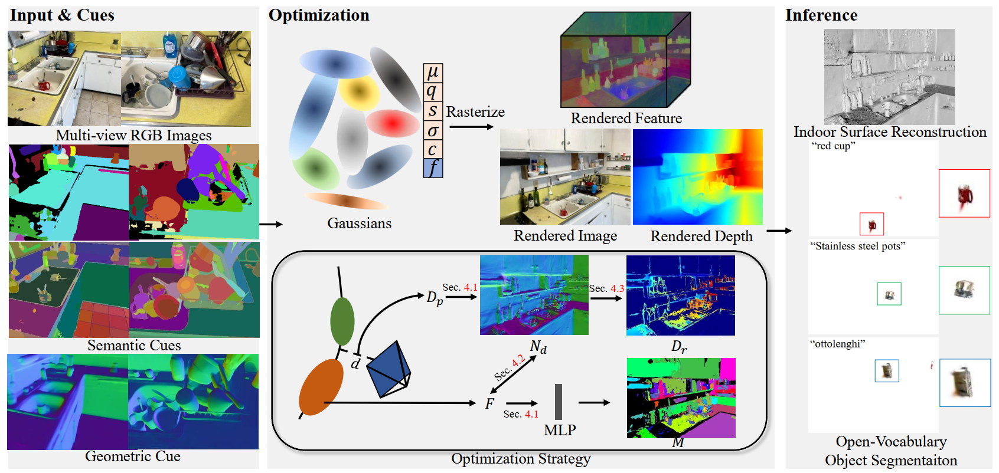

# GLS

**GLS: Geometry-aware 3D Language Gaussian Splatting**

[](https://arxiv.org/pdf/2411.18066)
[](https://jiaxiongq.github.io/GLS_ProjectPage/)



**GLS** extends indoor surface reconstruction and open-vocabulary segmentation by proposed novel strategy, to support **embodied intelligence** (e.g., navigation and manipulation). 
>Recently, 3D Gaussian Splatting (3DGS) has achieved significant performance on indoor surface reconstruction and open-vocabulary segmentation. This paper presents GLS, a unified framework of surface reconstruction and open-vocabulary segmentation based on 3DGS. GLS extends two fields by exploring the correlation between them. For indoor surface reconstruction, we introduce surface normal prior as a geometric cue to guide the rendered normal, and use the normal error to optimize the rendered depth. For open-vocabulary segmentation, we employ 2D CLIP features to guide instance features and utilize DEVA masks to enhance their view consistency. Extensive experiments demonstrate the effectiveness of jointly optimizing surface reconstruction and open-vocabulary segmentation, where GLS surpasses state-of-the-art approaches of each task on MuSHRoom, ScanNet++, and LERF-OVS datasets.

## Updates
- [2025.02.13]: We fine-tuned the hyperparameters based on the original paper and replaced the iphone point cloud with colmap point cloud as input.

The performance without sensor depth on the MuSHRoom dataset.
|     | Accuracy↓ | Completion↓ | Chamfer-L1↓ | Normal Consistency↑ | F-score ↑ |Time|
|-------|-------|-------|-------|-------|-------|-------|
|GLS(Paper)|0.0903|0.0703|0.0870|0.7830|0.5153|0.7h|
|GLS(Code_V1.0)|0.0538|0.0582|0.0560|0.8357|0.6922|0.7h|

## Citation

```bibtex
@article{qiu2024gls,
  title={GLS: Geometry-aware 3D Language Gaussian Splatting},
  author={Qiu, Jiaxiong and Liu, Liu and Su, Zhizhong and Lin, Tianwei},
  journal={arXiv preprint arXiv:2411.18066},
  year={2024}
}
```
